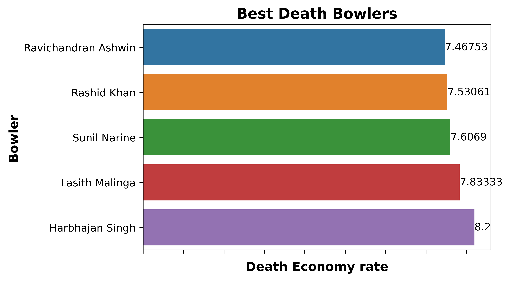
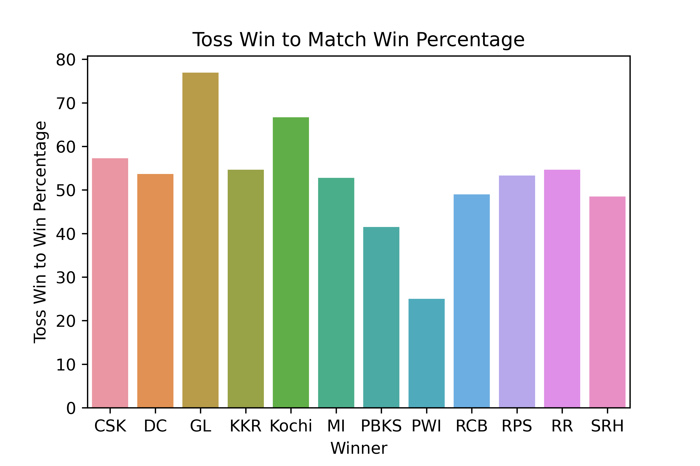
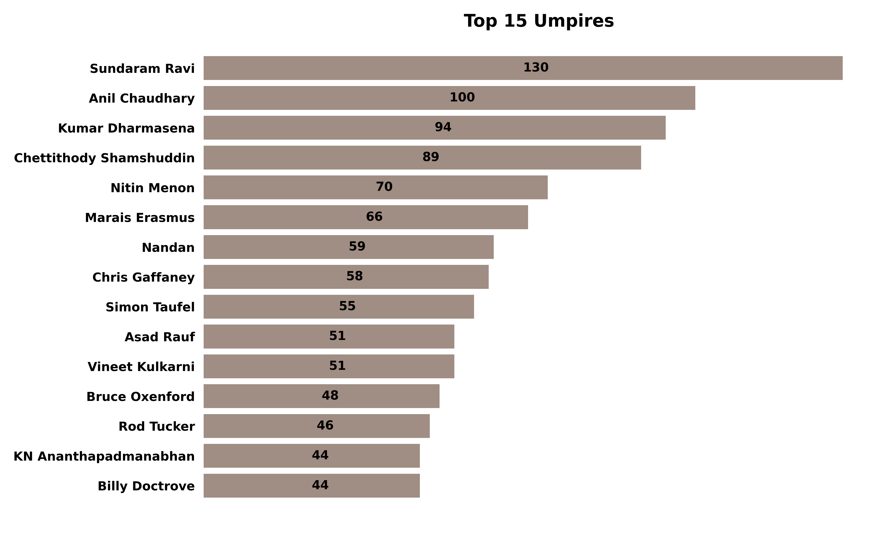

# IPLDataAnalysis
## Course Project CS685(Data Mining)

## Project Goal

The main aim of the project is to obtain data of all seasons of IPL played and study it to uncover fascinating results using the concepts and methods learned in the course CS685. There are many factors which may affect the outcome of a match ranging from players in the team to the weather and toss decision. The stages of executing a data mining project have been explained along with the motivation of doing this project. During the working, many interesting details were observed which highlighted the importance of Data Mining as a knowledge discovery process.
<br>


## Project Setup
This project Runs on Python 3.7.3 and uses the libraries in requirements.txt.

**Run** <br>
`$ pip3 install -r equirements.txt`

### Some Screenhots





## Project Overview

In the first stage, data was obtained from various sources. Although the datasets obtained have all the potential of providing the necessary information for extracting the results, they need to be pre-processed.
<br>
So, the next stage was pre-processing done in two steps. First was replacing the names of teams in some files to arrive at a universal name. The second step was merging of data wherever required.
<br>
After conversion of raw data to usable data, now the code for extracting useful information was written. Functions to determine specific results like effect of coin toss on the match outcome, runs per match of a given batsman, strike rate of a batsmen per match, runs of a batsmen per venue, etc were defined. To help visualise the information obtained using this code, they were presented in the forms of Pie charts, Density Plots and Bar graphs.
<br>


## Team Members::
```
1. Rohit Ranjan
2. Aman Tayal
3. Arpit Agarwal
4. Pranati Manjhi
5. Varchasv Shri
```


